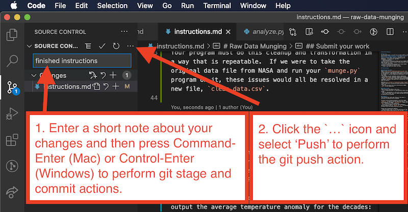

# SQL CRUD

Complete the following exercises. For each:

- determine the structure of any tables
- determine the data type of any fields
- determine which field(s) is the primary key for each table
- determine which field(s) is the foreign keys for any tables that require them
- write MySQL queries that perform the requested functionality.

## Part 1: Restaurant finder

Design a database table named `restaurants` that would allow an application that uses it to find restaurants.

### Table structure

Decide what fields and data types are necessary for the `restaurants` table. Bear in mind that the application must be able to filter restaurants by...

- **Category** (i.e. genre of food)
- **Price tier** (i.e cheap, medium, or expensive)
- **Neighborhood** (a particular NYC neighborhood)
- **Opening hours** (for simplicity, you can assume each restaurant has the same opening hours every day - stick to round hours, not half-hours)
- **Average rating** (out of 5 stars)
- **Good for kids** (true or false)

The application must also be able to allow users to leave reviews.

Write the SQL command to create the table with the structure you determine is necessary.

### Practice data

Insert realistic-looking dummy data for one thousand restaurants. You may find [mockaroo.com](https://mockaroo.com) helpful.

Include the practice data in a CSV file named `restaurants.csv` in the directory named `data`.

Write the SQLite commands necessary to import the data.

### Queries

Write a single SQL query to perform each of the following tasks:

1. Find all cheap restaurants in a particular neighborhood (pick any neighborhood as an example).

1. Find all restaurants in a particular genre (pick any genre as an example) with 3 stars or more, ordered by the number of stars in descending order.

1. Find all restaurants that are open now (see hint below).

1. Leave a review for a restaurant (pick any restaurant as an example).

1. Delete all restaurants that are not good for kids.

1. Find the number of restaurants in each NYC neighborhood.

#### Hint

The following SQLite code returns the current hour of the day, in 24 hour format in UTC time - this may be useful in determining whether a given restaurant is currently open or not `strftime('%H', 'now')`

To see the return value of this command directly (not as part of a comparison operation), use the following syntax: `SELECT strftime('%H', 'now');`

## Part 2: Social media app

The social media app you are designing a database for allows Users to share two kinds of content: **Messages** and **Stories**.

### Tables structure

Decide what fields and data types are necessary for the two tables necessary for this app: `users` and `posts`. The `posts` table stores both Messages and Stories.

Bear in mind that the application must be able to use these tables to perform the required functionality outlined below.

#### Users:

Users can register for the app by supplying their...

- email
- password
- handle (i.e. username).

#### Messages:

- Messages consist of text only.
- Messages are sent from one user to another specific user.
- Messages become invisible immediately after view and don't show up in the app thereafter.
- Messages are never actually deleted from the database table, even when invisible to the user (the social media company that produces the app keeps 'deleted' content in its database for future data harvesting, monetization purposes, and more.)

#### Stories:

- Stories consist of text only.
- Stories are public and every user can see them.
- Stories become invisible 24 hours after posting and don't show up in the app thereafter.
- Stories are never deleted from the database table, even when invisible to the user.

Write the SQL command to create these tables with the structure you determine is necessary.

### Practice data

Insert realistic-looking dummy data for one thousand Users, one thousand Messages, and one thousand Stories.

Include the practice data in CSV files named `users.csv` and `posts.csv` in the directory named `data`.

Write the SQLite commands necessary to import the data into the respective tables.

### Queries

Write a single SQL query to perform each of the followin tasks:

1. Register a new User.

1. Create a new Message sent by a particular User to a particular User (pick any two Users for example).

1. Create a new Story by a particular User (pick any User for example).

1. Show the 10 most recent visible Messages and Stories, in order of recency.

1. Show the 10 most recent visible Messages sent by a particular User to a particular User (pick any two Users for example), in order of recency.

1. Make all Stories that are more than 24 hours old invisible.

1. Show all invisible Messages and Stories, in order of recency.

1. Show the number of posts by each User.

1. Show the post text and email address of all posts and the User who made them within the last 24 hours.

1. Show the email addresses of all Users who have not posted anything yet.

### Hint

The following SQLite code returns the difference in hours between the time now and an earlier date and time - this may be useful in determining the number of hours that have passed since a post was made: `ROUND((JULIANDAY('now') - JULIANDAY('2021-02-21 12:50:00')) * 60)`

To see the return value of this command directly (not as part of a comparison operation), use the following syntax: `SELECT ROUND((JULIANDAY('now') - JULIANDAY('2021-02-21 12:50:00')) * 60);`

## Write a report

Update the `README.md` file to include the solutions to all of these instructions. For each part, be sure to include:

- the SQL code to create each of the required tables
- a link to each of the practice CSV data files in the `data` directory.
- the SQLite code to import the practice CSV data files into the tables.
- the SQL queries that solve each of the tasks you were asked to do. Make it clear which task each query is intended to solve - include the task number and text on the line above the SQL code solution.

Make the document well-formatted using Markdown code. Use clear headings and sub-headings and use Markdown's ability to embed code snippets into a document.

## Submit your work

Each student must submit this assignment individually. Use Visual Studio Code to perform git `stage`, `commit` and `push` actions to submit. These actions are all available as menu items in Visual Studio Code's Source Control panel.

1. Type a short note about what you have done to the files in the `Message` area, and then type `Command-Enter` (Mac) or `Control-Enter` (Windows) to perform git `stage` and `commit` actions.
1. Click the `...` icon next to the words, "Source Control" and select "Push" to perform the git `push` action. This will upload your work to your repository on GitHub.com.

